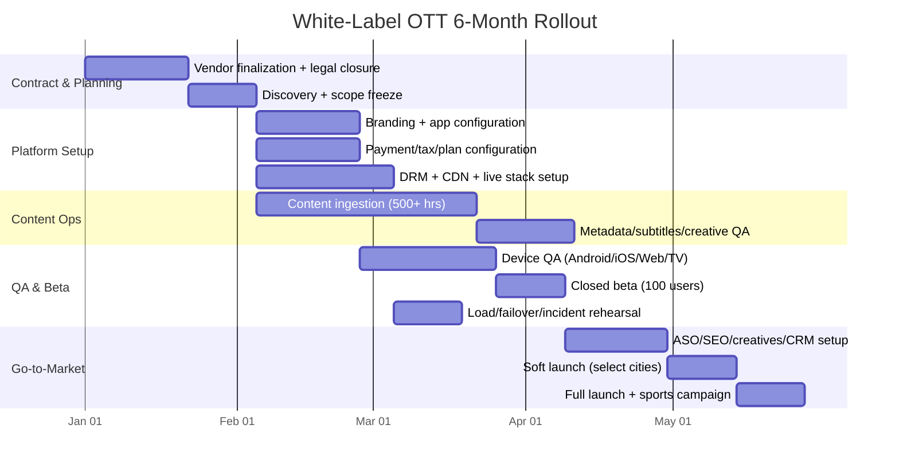

# White-Label Hotstar-Style OTT Launch Blueprint (India, 2026)

## Preview (What you will get if you execute this plan)
- **Go-live window:** 4–6 months from vendor signing.
- **Budget fit (platform only):** ₹25L–₹50L in Year 1 (excluding content rights).
- **Business model:** Hybrid AVOD + SVOD + PPV.
- **Core content engine:** Live Sports + Regional Movies (Tamil/Telugu/Hindi) + Originals (phase 2).
- **Founder outcome:** A practical procurement checklist, launch roadmap, risk controls, and a 30-day pre-launch operating plan.

---

## Founder Context
This blueprint is designed for a **non-technical founder** with no in-house development team, launching in India first and NRI markets second, using a **white-label OTT vendor**.

---

## SECTION 1: Vendor Selection Criteria (RFP + Contract Checklist)

## A) Non-Negotiables (must be in signed contract)

| Requirement | Why it matters | How to verify before signing | Contract language to demand |
|---|---|---|---|
| **LL-HLS support** | Live sports retention depends on low delay | Stopwatch demo: source feed vs app feed | Live latency SLA (target <=8 sec normal conditions) |
| **Multi-DRM (Widevine/PlayReady/FairPlay)** | Rights protection for premium movies/sports | Device matrix test on Android/iOS/Web/TV | DRM must cover all launch platforms |
| **Concurrent stream monitoring** | Prevents account sharing leakage | Simulate over-limit streams and auto-enforcement | Per-plan stream/device cap policy |
| **1M+ spike-readiness pathway** | IPL-like traffic bursts can crash weak stacks | Ask for load-test evidence + event case study | Capacity commitment + match-day war-room |
| **24/7 live incident support** | Outages during matches cause revenue damage | Verify named escalation contacts | P1 response SLA + service credits |
| **India payments** (Razorpay/Cashfree/PhonePe + recurring) | Checkout convenience drives conversion | UAT for UPI, cards, mandates, retries | Multi-gateway failover + reconciled webhooks |
| **Data ownership/exportability** | Subscriber data is your long-term asset | Request data export/API demonstration | Founder owns user/content/analytics data |

### Mandatory Event Readiness Gate
Before launch, vendor must run one end-to-end simulation covering:
- Live traffic spike
- Chat moderation load
- Payment surge
- CDN failover
- Incident escalation drill

## B) Nice-to-Haves
- Tournament bracket and fixture journey UI.
- Multi-audio + subtitle language packs.
- Real-time score overlays and key moments.
- Emoji reactions and fan polls.
- Language-personalized recommendation rails.

## C) Red Flags
- No provable Indian OTT references.
- Vendor revenue share on your subscription revenue >10%.
- No 24/7 P1 support model.
- Hidden overage fees (CDN/storage/bandwidth).
- Vendor control over your app store ownership or customer data.

## D) Vendor Score Model (weighted)
- Reliability + scale = **35%**
- Monetization fit = **25%**
- Time-to-launch = **20%**
- 12-month TCO = **20%**

---

## SECTION 2: Feature Specification

## A) User App Features (Android, iOS, Web, TV)

### 1) Login & Registration
- Primary: Mobile OTP.
- Secondary: Email/password.
- Optional: Google login.
- Device screen for “active sessions” + remote logout.

### 2) Home & Discovery
- Dynamic rails:
  - Live Now
  - Trending in Your Language
  - Continue Watching
  - Exclusive Originals
- Language onboarding (Tamil/Telugu/Hindi/English).
- Personalized recommendations.

### 3) Video Player
- Double-tap seek and vertical swipe brightness/volume.
- Adaptive bitrate auto-switching + manual override.
- Multi-audio and subtitles.
- Chromecast + AirPlay support.
- Cross-device resume.

### 4) Offline Downloads (Premium only)
- DRM-protected offline playback.
- Download expiry policy.
- Data Saver / Balanced / High quality modes.

### 5) Multi-Profile
- Up to 5 profiles per account.
- Kids profile with PIN and age filters.
- Profile-specific language and watch preference.

### 6) Live Sports UX
- Side-panel live chat with moderation controls.
- Emoji reactions.
- Score ticker and key stats cards.
- Graceful fallback prompts on poor network.

## B) Admin Panel Features (Founder backend)

### 1) CMS
- Drag-and-drop rail management.
- Time-based scheduling (e.g., Friday 8 PM release).
- Geo-rights windows and publish automation.

### 2) User Management
- Active user/device visibility.
- Force logout by device.
- Chat moderation and spam controls.

### 3) Analytics Dashboard
- Real-time concurrency.
- Startup delay, buffering ratio, fatal errors.
- Drop-off curves (where users leave).
- Revenue split by plan/language/city.

### 4) Payment Stack
- Razorpay + Cashfree + PhonePe.
- Monthly/yearly recurring billing with retries.
- GST invoicing and reconciliation reports.

### 5) AVOD Ad Controls
- Pre-roll and mid-roll placement.
- Frequency caps and ad pod limits.
- Google Ad Manager (or native vendor ad tool).

---

## SECTION 3: Monetization Logic (AVOD + SVOD + PPV)

## 1) Subscription Tiers

| Plan | Price | Quality | Devices | Offline | Best for |
|---|---:|---|---:|---|---|
| Mobile | ₹399/year | SD | 1 | No | Entry-level, mobile-only users |
| Super | ₹899/year | HD | 2 | Yes | Family and regional movie users |
| Premium | ₹1499/year | 4K | 4 | Yes | Power users and English library seekers |

### Upsell Logic
- Hit stream/device limit -> suggest next tier.
- Repeat download behavior -> prompt upgrade.
- PPV repeat buyers -> annual Super/Premium offer.

## 2) AVOD Free Tier
- Free catalog with ad-supported playback.
- Ads: pre-roll + mid-roll.
- Optional quality cap for free users (SD/HD).
- Inventory via Google Ad Manager or vendor ad server.

## 3) PPV for Live Sports
- Single match pass (example: ₹25).
- Weekend packs and mini-tournament packs.
- Conversion funnel from PPV to annual plan.

## 4) Year-1 KPI Targets
- Free-to-paid conversion: 2–5%.
- Payment success: >=92% at launch, target >=95% after optimization.
- Monthly paid churn: <6% by month 9.
- Ad fill rate on free inventory: >70%.

---

## SECTION 4: Technical Architecture & Scalability

## A) Required Architecture Blocks
1. Redundant live ingest + transcoding with ABR ladders.
2. LL-HLS packaging + Multi-DRM enforcement.
3. Multi-CDN strategy (Akamai/CloudFront + India-optimized route).
4. Autoscaled services: auth/catalog/billing/chat.
5. Observability: QoE metrics, logs, incident alerts.
6. Engagement pipeline: CleverTap/MoEngage integration.

## B) Contract Guardrails
- Documented autoscaling policy and thresholds.
- Multi-region failover runbook.
- RTO <=15 min, RPO <=5 min for critical workloads.
- 2x projected peak capacity before marquee events.
- Quarterly disaster and failover rehearsals.

## C) Day-1 Stability Checklist
- CDN failover tested in staging and production.
- Playback tested on weak network profiles.
- Match-day moderation staffing planned.
- Live NOC dashboard access for founder team.

---

## SECTION 5: 30-Day Pre-Launch Plan

## Week 1: Contract + catalog foundation
- Close MSA/SOW/SLA with penalties and escalation matrix.
- Freeze launch scope (platforms, cities, languages).
- Start catalog onboarding target: 500+ hours.
- Lock metadata and artwork templates.

## Week 2: Product configuration
- Apply brand elements (logo/color/splash/app icon).
- Configure plans, gateways, ad rules, and taxes.
- Enable moderation and policy controls.
- Validate top 20 critical user journeys.

## Week 3: Beta + growth prep
- Closed beta with 100 controlled users.
- ASO copy for: “Live Cricket Streaming”, “Tamil Movies Online”, “Telugu Movies & Web Series”.
- Set up CRM journeys: welcome, failed payment, match reminder.

## Week 4: Soft launch + optimization
- City-level campaigns (Chennai, Hyderabad, Bengaluru).
- Monitor CAC, payment success, startup delay, buffering, crashes.
- Iterate paywall messaging and ad frequency.
- Run go/no-go review for wider launch.

---

## SECTION 6: Deliverables

## 6.1 Comparison Matrix (Indicative 2026 pricing)

> Note: pricing is indicative; final pricing depends on MAU, feature scope, DRM, app count, and live-event loads.

| Vendor | Indicative Year-1 Platform Cost | India fit | Strength | Watch-out |
|---|---:|---|---|---|
| Contus VPlay | ₹20L–₹50L | High | Live-event orientation | Scope/service split must be explicit |
| VPlayed | ₹18L–₹45L | High | Customization + DRM positioning | Add-ons can inflate TCO |
| Muvi | ₹12L–₹35L | Medium-High | Faster SaaS setup | Deeper customization may need higher tier |
| Zype | ₹15L–₹40L (FX-based) | Medium | API-first flexibility | India-local payment/localization validation needed |
| Uscreen | ₹8L–₹25L | Medium | Fast onboarding | Sports-scale requirements may need extra tooling |

### Shortlist method
Run a 2-week paid PoC for top 3 vendors:
1. High-concurrency live stream simulation
2. AVOD journey validation
3. Subscription checkout and renewal flow

## 6.2 Gantt Chart (6-Month Signing-to-Launch Roadmap)

## 6.3 Risk Assessment (Top 5 + Fast Mitigation)

| Risk | Early signal | 0–4 hr action | Prevention |
|---|---|---|---|
| CDN outage during live match | Region-wise buffering surge | Switch to backup CDN, reduce top bitrate rung | Multi-CDN routing + pre-event stress test |
| Payment gateway downtime | Checkout failures spike | Trigger gateway failover order | Multi-gateway orchestration + reconciliation |
| Piracy/account sharing | Concurrency anomalies, leaked links | Enforce stream caps, rotate tokens, watermark streams | Anti-piracy monitoring + stricter device policy |
| Slow vendor P1 response | No action in first 10–15 min | Trigger escalation and war-room bridge | SLA penalties + mock incident drills |
| Weak free-to-paid conversion | High DAU, poor checkout completion | Simplify paywall, localized offers | Ongoing funnel A/B testing + CRM nudges |

## 6.4 Content Acquisition Checklist

## A) Legal
- Signed rights by territory/language/window.
- Explicit rights for VOD/live/clips/trailers/promos.
- Takedown and indemnity clauses.
- Indian ratings/compliance readiness.

## B) Assets
- Mezzanine masters per ingest spec.
- Poster packs (portrait/landscape), thumbnails, logos.
- Trailer cuts (15s, 30s, 60s).
- Subtitle/caption and audio language files.

## C) Metadata
- Localized titles + short/long synopsis.
- Cast/crew, genre, release year, language tags.
- Maturity labels and advisories.
- Sports metadata (league/team/season/match IDs/highlights).

## D) QA
- AV and subtitle sync checks.
- DRM playback verification across target devices.
- Geo-rights and schedule window validation.
- Final legal + content-ops sign-off.

---

## Year-1 Budget Split (Platform only: ₹25L–₹50L)

| Cost head | Lean | Growth |
|---|---:|---:|
| White-label license + app packaging | ₹9L | ₹18L |
| CDN/DRM/streaming infra | ₹5L | ₹10L |
| Managed support + NOC/event ops | ₹3L | ₹6L |
| Analytics/CRM tools | ₹2L | ₹5L |
| Marketing experiments | ₹6L | ₹11L |
| **Total** | **₹25L** | **₹50L** |

---

## 10-Day Founder Action Sprint
1. Send RFP to 5 vendors using Section 1 requirements.
2. Verify at least 2 Indian customer references per vendor.
3. Negotiate fixed-fee with overage caps and SLA penalties.
4. Freeze MVP for 4-month launch and avoid feature creep.
5. Lock launch content slate and one marquee live event.
6. Appoint content-ops partner for metadata + QA throughput.
7. Pre-book launch creatives and city-level media plan.
8. Run UAT sign-off meeting with vendor and internal stakeholders.
9. Validate dashboards for payments, QoE, and conversion.
10. Confirm soft-launch date and incident war-room staffing.
