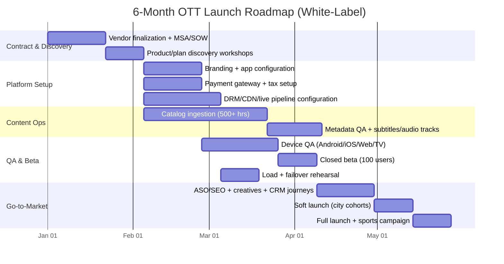

# White-Label Hotstar Clone Launch Plan (India, 2026)

## Executive Snapshot
- **Business goal:** Launch a Disney+ Hotstar-like OTT platform in **4–6 months** using a white-label vendor.
- **Primary market:** India (tier-1 + tier-2/3 cities), **secondary market:** NRI audiences.
- **Content strategy:** Live sports (retention anchor) + regional films (Tamil/Telugu/Hindi) + originals (phase 2).
- **Monetization model:** Hybrid **AVOD + SVOD + PPV**.
- **Year-1 platform budget (excluding content rights):** **₹25L–₹50L**.

---

## Section 1: Vendor Selection Criteria (Execution Checklist)

### 1) Non-Negotiables (must be contractually guaranteed)

| Area | Requirement | What to Ask Vendor | Acceptance Test |
|---|---|---|---|
| Live streaming latency | **HLS Low-Latency** support | “Do you support LL-HLS end-to-end (encoder → origin → CDN → apps)?” | Live event demo with glass-to-glass latency target <8s |
| Content security | **Multi-DRM:** Widevine, PlayReady, FairPlay | “Do you provide packaged DRM for Android/Chrome, Edge/Smart TV, Safari/iOS?” | DRM playback test matrix across Android/iOS/Web/TV |
| Account sharing control | **Concurrent stream monitoring** + device/session rules | “Can we cap streams per plan and auto-block suspicious logins?” | Simulate 5+ concurrent sessions and enforce plan limits |
| Spike handling | **1M+ concurrency readiness** (or documented path) | “Share load test reports, CDN multi-origin setup, autoscaling policy” | Run mock event load test with signed SLA targets |
| Reliability | 99.9%+ uptime SLA; major incident response | “What is P1 response & resolution SLA?” | SLA in MSA + service credits |
| India payments | Razorpay/Cashfree/PhonePe + recurring billing | “UPI + cards + netbanking + mandate retries?” | Sandbox + production pilot completion |
| Support | **24/7 NOC support** during live sports | “Dedicated war-room during marquee matches?” | Named escalation matrix in contract |

### 2) Nice-to-Haves (prioritize if budget permits)
- Built-in **tournament bracket UI** for league journeys.
- Multi-language audio switching and subtitle tracks.
- AI recommendations tuned by language and watch behavior.
- Real-time sports overlays (scorebug, stats cards).
- Built-in cohort analytics and churn prediction.

### 3) Red Flags (walk away / renegotiate)
- No Indian OTT case studies or references.
- Vendor insists on high revenue share from your subscription income (>10%).
- No 24/7 support or no incident manager for live events.
- Ambiguous ownership of user data or vendor controls your subscriber list.
- No written disaster recovery objective (RTO/RPO).

### 4) Commercial Terms You Should Lock
- Fixed platform fee + transparent overage slabs (bandwidth, MAU, storage).
- No lock-in on your catalog/user data export.
- Escalating discount after 100K/250K/500K paid users.
- Cap annual price hike (e.g., max 8–10%).
- Explicit deliverables for Android, iOS, Web, Android TV/Fire TV.

---

## Section 2: Feature Specification

### A) User App Features (Android, iOS, Web, TV)

#### Must-have MVP
1. **Auth & onboarding**
   - Mobile OTP login (primary), Email/Password (secondary), optional Google login.
   - Device management screen (active sessions, remove device).
2. **Home & discovery**
   - Dynamic rails: Live Now, Trending in Your Language, Continue Watching, Exclusive Originals.
   - Language-first onboarding (Tamil/Telugu/Hindi/English preferences).
3. **Playback UX**
   - Adaptive bitrate (ABR), auto-quality switching, manual quality override.
   - Double-tap seek, swipe brightness/volume, subtitle/audio switch.
   - Chromecast/AirPlay casting.
4. **Premium-only downloads**
   - Offline DRM, expiry rules, download quality selector.
5. **Profiles**
   - Up to 5 profiles/account; Kids profile with PIN and content ratings filter.
6. **Live sports engagement**
   - Side chat panel with moderation, emoji reactions, real-time score ticker.

#### Launch+1 improvements
- Watch party, fan polls, fantasy integration hooks, multilingual commentary packs.

### B) Admin Panel Features (Founder Backend)
1. **CMS**
   - Drag-drop rail editor, release scheduling (“Friday 8 PM”), geo-rights windows.
   - Metadata templates (genre, cast, language, maturity, keywords).
2. **User Management**
   - Active devices, force logout, account flags, chat spam bans.
3. **Analytics**
   - Real-time concurrent viewers, drop-off funnel, ad fill rate, ARPU, churn.
4. **Monetization setup**
   - Plan builder (monthly/yearly), coupon campaigns, grace period and dunning.
5. **Payments**
   - Razorpay + Cashfree + PhonePe with retries, webhooks, GST-compliant invoicing.
6. **Ad stack**
   - Google Ad Manager (or native ad module), pre/mid-roll scheduling, frequency caps.

---

## Section 3: Monetization Strategy (AVOD + SVOD + PPV)

### 1) Tiered SVOD logic

| Plan | Price | Quality | Devices | Downloads | Audience |
|---|---:|---|---:|---|---|
| Mobile | ₹399/year | SD | 1 | No | Price-sensitive mobile-first users |
| Super | ₹899/year | HD | 2 | Yes | Mainstream family users |
| Premium | ₹1499/year | 4K | 4 | Yes | Power users + English content seekers |

**Operational rules:**
- Annual plans default; monthly top-up option for acquisition campaigns.
- Device cap enforced by concurrent stream monitoring.
- Premium unlocks English/Hollywood libraries (rights permitting).

### 2) AVOD (Free tier)
- Free users see ad-supported content with capped quality (e.g., 480p/720p).
- Ad policy: pre-roll + mid-roll + limited banner inventory on home pages.
- Inventory control via Google Ad Manager or vendor ad stack.
- Guardrails: frequency capping, ad pod limits, kid-safe ad categories.

### 3) PPV for live sports
- Non-subscribers can buy a **match pass** (e.g., ₹25/match).
- Upsell logic:
  - If user buys 3 match passes in 30 days, push upgrade to Super plan.
  - Bundle “Weekend Sports Pass” for better conversion.

### 4) Revenue KPI targets (Year 1 baseline)
- Free→Paid conversion: 2–5% (early-stage realistic range).
- Monthly churn target: <6% by month 9.
- Ad fill rate target: >70% on free inventory.
- PPV to SVOD upgrade rate: >12% among repeat PPV users.

---

## Section 4: Technical Architecture & Scalability Requirements

### Required architecture (vendor responsibility)
1. **Ingest & packaging**
   - Live ingest with redundant encoders.
   - ABR ladder creation + LL-HLS packaging.
2. **DRM and entitlement**
   - Multi-DRM license service + entitlement checks by plan.
3. **Origin + CDN layer**
   - Multi-CDN strategy (Akamai/CloudFront/local India CDN) with routing controls.
4. **Autoscaling app services**
   - Kubernetes/ECS autoscaling for auth, catalog, payments, chat.
5. **Data and observability**
   - Centralized logs, metrics, alerting; dashboard for QoE, errors, concurrency.
6. **Engagement stack**
   - CleverTap/MoEngage integration for push, journeys, reactivation.

### Scale-proof requirements (put in contract)
- **Autoscaling triggers:** CPU, request rate, concurrent sessions.
- **Failover:** Active-active or active-passive multi-region with tested runbooks.
- **RTO/RPO:** RTO ≤ 15 min, RPO ≤ 5 min for critical metadata.
- **Chaos drills:** Quarterly failover drills before major tournaments.
- **Capacity planning:** 2x peak headroom during marquee matches.

---

## Section 5: 30-Day Pre-Launch Plan (Founder-Friendly)

### Week 1: Foundation
- Finalize vendor MSA/SOW + SLA and support escalation contacts.
- Upload initial catalog target: **500+ hours** (trailers, posters, metadata complete).
- Freeze launch territories and language priorities.

### Week 2: Product setup
- Apply brand kit (logo, color system, splash screens, app icon).
- Configure plans, ad policy, payment gateways, GST settings.
- Closed beta with 100 trusted users (friends/family/partners).

### Week 3: Growth readiness
- ASO/SEO assets for “Live Cricket Streaming”, “Tamil Movies Online”, etc.
- Create launch creatives (15s/30s/60s videos + static banners).
- Build CRM journeys: onboarding, abandoned payment, match reminders.

### Week 4: Soft launch + learning
- Geo-focused paid campaigns (e.g., Chennai, Hyderabad) to validate CAC.
- Monitor crash-free sessions, start time, buffering ratio, payment success rate.
- Iterate pricing copy, onboarding UX, and free→paid nudges.

---

## Section 6: Deliverables

## 6.1 Comparison Matrix: Top White-Label OTT Vendors (India-Relevant)

> **Note:** Pricing is indicative and varies by MAU, features, apps, and support tier. Always confirm via signed quote.

| Vendor | India fit | Typical pricing signal (Year 1, platform only) | Strengths | Watch-outs | Best for |
|---|---|---|---|---|---|
| **VPlayed (Contus)** | Strong India presence | ₹18L–₹45L setup + support bands | Customization depth, DRM options, enterprise workflows | Can require careful scope control to avoid cost creep | Regional OTTs needing customization |
| **Contus VPlay** | India-focused streaming stack | ₹20L–₹50L depending on live + DRM + apps | Live streaming modules, scalability consulting | Clarify what is product vs services | Sports + event-heavy platforms |
| **Muvi** | Global SaaS with India usage | ₹12L–₹35L annualized + app fees | Faster deployment, integrated modules | Enterprise add-ons can increase TCO | Fast go-live with lower ops overhead |
| **Zype** | Strong global tech | ₹15L–₹40L equivalent (FX-dependent) | API-first flexibility, integrations | India payment/localization depth to validate | Teams with integration partners |
| **Uscreen** | Creator-led OTT strength | ₹8L–₹25L annualized (feature-tier dependent) | Ease of use, lower complexity | Live sports scale and India-specific flows may need add-ons | Niche/community OTT launches |

### Recommended vendor shortlisting approach
- Shortlist 3 vendors; run a paid proof-of-concept for one live event + one VOD funnel.
- Score by weighted matrix: 35% reliability, 25% monetization fit, 20% timeline, 20% TCO.

## 6.2 6-Month Gantt Chart (Signing → Scaled Launch)

## 6.3 Risk Assessment (Top 5 + Fast Mitigation)

| Risk | Early warning signals | Immediate response (0–4 hrs) | Preventive controls |
|---|---|---|---|
| CDN outage / buffering spike during match | Rebuffering ratio jumps; region-specific failures | Switch to secondary CDN, reduce top bitrate rung, incident banner in app | Multi-CDN routing, pre-event load test, runbook rehearsals |
| Payment gateway downtime | Drop in payment success rate; timeout errors | Auto-failover gateway sequence (Razorpay→Cashfree→PhonePe), retry queue | Multi-gateway orchestration, webhook reconciliation |
| Piracy leakage / credential sharing | Sudden concurrency anomalies; leaked links | Rotate tokens/DRM keys, enforce session caps, watermark critical feeds | Forensic watermarking, strict device policy, anti-piracy monitoring |
| Vendor support delay during P1 | Slow response to live incident | Escalate via contractual war-room, invoke SLA penalties | Named escalation tree, quarterly mock incident drills |
| Poor conversion from free to paid | High MAU, low checkout completion | Simplify paywall, targeted offers, language-specific value messaging | A/B testing, funnel analytics, lifecycle campaigns |

## 6.4 Content Acquisition Checklist

### Legal & rights
- Signed content license agreement with territory/language/platform windows.
- Clear rights for VOD, live, clips, trailers, and promotional usage.
- Censor and rating compliance workflow (India-specific).

### Asset prep
- Master video files in agreed mezzanine format.
- Trailer cuts (15s, 30s, 60s), key art (portrait/landscape), thumbnails.
- Subtitle and caption files (SRT/TTML) + multi-audio stems where available.

### Metadata standards
- Title, synopsis (short/long), cast, crew, release year, genre, language.
- Content advisories, age ratings, tags for recommendation engine.
- Sports-specific tags: teams, tournament, season, matchday, highlights marker.

### QA gates
- Audio sync, subtitle sync, poster safe area, trailer playback.
- Rights window checks (start/end), geo-block validation, DRM verification.
- Final approval checklist signed by content ops + legal.

---

## Suggested Year-1 Budget Split (Platform-Only, ₹25L–₹50L)

| Cost head | Lean Plan | Growth Plan |
|---|---:|---:|
| White-label license + apps | ₹10L | ₹18L |
| DRM/CDN/streaming infra | ₹5L | ₹10L |
| Support + managed ops | ₹3L | ₹6L |
| Analytics/CRM tools | ₹2L | ₹5L |
| Marketing test budget | ₹5L | ₹11L |
| **Total** | **₹25L** | **₹50L** |

---

## Founder Action Plan (Next 10 Days)
1. Issue an RFP to 5 vendors with non-negotiables + SLA template.
2. Ask each vendor for one Indian sports/live case reference and conduct calls.
3. Run a commercial negotiation on fixed fee vs revenue share.
4. Freeze launch scope: languages, platforms, and one marquee live event.
5. Book content operations partner for metadata, trailers, and QC.
