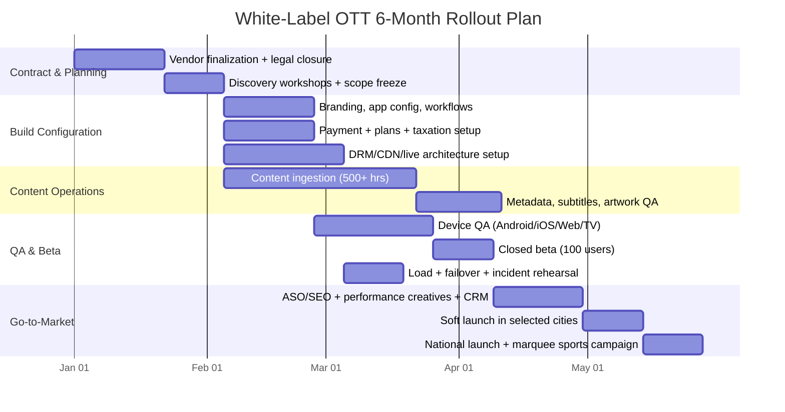

# White-Label Hotstar-Style OTT Launch Blueprint (India, 2026)

## Who this is for
A non-technical founder in India using a **white-label OTT vendor** (no internal engineering team), targeting launch in **4–6 months** with a **₹25L–₹50L Year-1 platform budget** (excluding content licensing).

---

## SECTION 1: Vendor Selection Criteria (Use this as your RFP + Contract Checklist)

## A) Non-Negotiables (must be in signed contract)

| Requirement | Why it matters for your business | How to verify before signing | Contract clause to insist on |
|---|---|---|---|
| **LL-HLS (Low-Latency HLS)** | Live sports stickiness dies if stream is far behind real time | Ask for live demo with stopwatch (ground feed vs app feed) | Max live latency SLA (e.g., <=8 sec under normal load) |
| **Multi-DRM (Widevine, PlayReady, FairPlay)** | Premium movie/sports rights require anti-piracy controls | Cross-device test matrix: Android, iOS Safari, Web, TV | DRM availability across all launch platforms |
| **Concurrent stream monitoring** | Reduces account sharing and revenue leakage | Simulate over-limit logins and confirm auto-block/step-up auth | Device + stream limit policy by plan |
| **1M+ spike readiness path** | IPL-style events create burst traffic and churn risk if app fails | Ask for load-test report + prior event case study | Capacity commitment + event war-room support |
| **24/7 incident support** | Live outages are revenue-critical | Demand escalation tree with named contacts | P1 response SLA (e.g., 5–15 min) + service credits |
| **India payment stack** (Razorpay/Cashfree/PhonePe + recurring) | Subscription conversion depends on familiar payment methods | End-to-end UAT: UPI intent, cards, autopay, retries | Multi-gateway failover, webhook reconciliation |
| **Data ownership** | Your subscriber base must remain your asset | Verify data export APIs + report access | Full ownership of users, analytics, content metadata |

### Event-readiness gate (mandatory before launch)
- Vendor must run at least **one full dress rehearsal** for live sports:
  - simulated traffic spike,
  - chat moderation load,
  - payment surge,
  - failover drill.

## B) Nice-to-Haves (prioritized if budget allows)
- Built-in **Tournament Bracket UI** and fixture pages.
- Multi-language audio tracks and subtitle packs.
- Real-time score overlays and “key moments” markers.
- In-app fan polls / emoji reactions.
- AI-driven recommendations by language and genre.

## C) Red Flags (renegotiate or walk away)
- No real Indian OTT customer references.
- Revenue share on your subscription revenue >10%.
- No 24/7 support for P1 incidents.
- No transparent overage pricing (bandwidth/CDN/storage).
- Vendor controls core app store accounts or content rights metadata.

## D) Vendor scorecard (weighted)
Use this simple weighted model when comparing vendors:
- **Reliability + live scale:** 35%
- **Monetization fit (AVOD/SVOD/PPV):** 25%
- **Time-to-launch:** 20%
- **Total cost of ownership (12 months):** 20%

---

## SECTION 2: Feature Specification (What to ask vendor to deliver)

## A) User App Features (Android, iOS, Web, TV)

### 1) Login & Registration
- **Primary:** Mobile OTP login.
- **Secondary:** Email/password.
- Optional: Google sign-in.
- Device management page: “Logged in devices” + remote logout.

### 2) Home Screen & Discovery
- Dynamic rails/carousels:
  - **Live Now**
  - **Trending in Your Language**
  - **Continue Watching**
  - **Exclusive Originals**
- Language onboarding (Tamil, Telugu, Hindi, English).
- Personalization based on watch history.

### 3) Video Player (core UX)
- Gesture controls: double-tap seek, vertical brightness/volume swipe.
- Auto-quality (ABR) with manual quality override.
- Multi-audio + subtitles.
- **Chromecast/AirPlay** support.
- Resume playback across devices.

### 4) Offline Downloads (premium only)
- Available only for paying tiers.
- Download expiry + DRM-protected offline playback.
- Quality selector (Data Saver / Balanced / High).

### 5) Multi-Profile
- Up to **5 profiles per account**.
- Kids profile with PIN + age rating filter.
- Profile avatar and language preferences per profile.

### 6) Live Sports Experience
- Live chat side panel with moderation controls.
- Emoji reactions.
- Match score ticker + mini-stat cards.
- Stream health fallback (quality downgrade prompt if bandwidth drops).

## B) Admin Panel Features (Founder backend)

### 1) CMS
- Drag-and-drop content rails.
- Episode and movie scheduling (“Go live Friday 8 PM”).
- Geo-rights windows + publish/unpublish automation.

### 2) User Management
- Active users and active devices dashboard.
- Force logout specific devices.
- Ban / mute chat spammers.

### 3) Analytics Dashboard
- Real-time concurrent viewers.
- Startup time, buffering ratio, playback failures.
- Drop-off points (minute-wise churn in videos).
- Revenue split by plans, city, language.

### 4) Payment Integration
- Razorpay, Cashfree, PhonePe.
- Monthly/yearly recurring billing + retry logic.
- GST-ready invoices and reconciliation reports.

### 5) Ad Management (AVOD)
- Pre-roll + mid-roll ad slot configuration.
- Frequency capping and ad pod limits.
- Google Ad Manager (or vendor ad server) support.

---

## SECTION 3: Monetization Strategy (Hybrid AVOD + SVOD + PPV)

## 1) Tiered Subscription Plans

| Plan | Price | Quality | Devices | Offline | Ideal user profile |
|---|---:|---|---:|---|---|
| **Mobile** | ₹399/year | SD | 1 | No | Price-sensitive single-device users |
| **Super** | ₹899/year | HD | 2 | Yes | Family and regular regional-content users |
| **Premium** | ₹1499/year | 4K | 4 | Yes | Multi-device power users + English library seekers |

### Pricing logic to implement
- Annual plans as default anchor.
- Limited-time monthly plans for acquisition campaigns.
- Smart upsell prompts:
  - At device-limit hit -> suggest higher plan.
  - After repeated downloads -> suggest Super/Premium.

## 2) AVOD (Free Tier)
- Free catalog access with ads.
- Ad placements:
  - Pre-roll before content starts.
  - Mid-roll in long-form content.
- Free tier quality cap (e.g., SD/HD depending on ad yield).
- Integrate with Google Ad Manager or native ad engine.

## 3) Live Sports PPV
- Non-subscribers can buy **single match passes** (e.g., ₹25/match).
- “Weekend pass” and “Tournament mini-pack” bundles.
- Upgrade nudge: after 2–3 PPV purchases, offer Super annual at discount.

## 4) Minimum KPI Targets for Year 1
- Free-to-paid conversion: **2–5%**.
- Payment success rate: **>=92%** at launch, improve to >=95%.
- Monthly subscriber churn: **<6%** by month 9.
- Ad fill rate (free inventory): **>70%**.

---

## SECTION 4: Technical Architecture & Scalability (Vendor responsibilities)

## A) Required architecture blocks
1. **Live ingest + transcoding**: redundant encoders, ABR ladder.
2. **Packaging + protection**: LL-HLS + Multi-DRM.
3. **Origin + Multi-CDN**: Akamai/CloudFront + India-strong CDN route.
4. **Microservices autoscaling**: auth, catalog, billing, chat.
5. **Observability layer**: QoE dashboards, alerting, log correlation.
6. **Engagement integrations**: CleverTap/MoEngage for push + journeys.

## B) Scalability guardrails for contract
- Auto-scaling policy documented and tested.
- Multi-region failover with runbook.
- RTO <=15 minutes, RPO <=5 minutes for business-critical services.
- Pre-event capacity checks with 2x expected peak headroom.
- Quarterly disaster simulation drills.

## C) Day-1 no-crash checklist
- CDN failover tested in staging and production.
- Playback tested across low-network (3G/weak 4G) conditions.
- Peak chat moderation staffing assigned for live events.
- Real-time NOC dashboard shared with founder team.

---

## SECTION 5: 30-Day Pre-Launch Plan (Non-technical founder playbook)

## Week 1: Commercial + content onboarding
- Finalize MSA/SOW/SLA with penalties and escalation matrix.
- Freeze launch scope (platforms, languages, target cities).
- Upload initial content library target: **500+ hours**.
- Lock metadata standards and artwork templates.

## Week 2: App branding + functional setup
- Apply brand kit (logo, color palette, app icon, splash).
- Configure subscription plans + ad rules + payment gateways.
- Enable chat moderation workflows and user policy.
- Conduct internal UAT on top 20 user journeys.

## Week 3: Beta + growth setup
- Closed beta with 100 users (friends/family/partners).
- App Store/Play Store listing drafts:
  - “Live Cricket Streaming”
  - “Tamil Movies Online”
  - “Telugu Movies & Web Series”
- Setup CRM journeys (welcome, payment failed, match reminder).

## Week 4: Soft launch + optimization
- City-wise paid tests (e.g., Chennai, Hyderabad, Bengaluru).
- Track CAC, trial-to-paid, payment success, buffering, crashes.
- Tune pricing copy, paywall flow, and ad load settings.
- Prepare full launch report and go/no-go decision.

---

## SECTION 6: Deliverables

## 6.1 Comparison Matrix — 5 White-Label Vendors (Indicative 2026 view)

> Pricing below is indicative and can vary significantly by MAU, app count, DRM, support SLAs, and live-event volumes.

| Vendor | Approx Year-1 Platform Cost (excluding content) | India-market readiness | Strengths | Watch-outs |
|---|---:|---|---|---|
| **Contus VPlay** | ₹20L–₹50L | High | Live-streaming modules, enterprise deployment options | Scope clarity needed (platform vs custom services) |
| **VPlayed** | ₹18L–₹45L | High | Flexible customization, DRM-focused positioning | Costs can rise with add-ons and managed services |
| **Muvi** | ₹12L–₹35L | Medium-High | Faster SaaS deployment, all-in-one operations | App customization depth may need higher tiers |
| **Zype** | ₹15L–₹40L (FX dependent) | Medium | API-first architecture, integration flexibility | Local payments and India localization need verification |
| **Uscreen** | ₹8L–₹25L | Medium | Quick setup, creator-friendly workflows | Live sports scale and India-specific requirements may need extra tooling |

### Recommendation
Shortlist top 3, then run a **2-week paid proof-of-concept**:
- one high-concurrency live stream,
- one AVOD funnel,
- one subscription checkout flow.

## 6.2 Gantt Chart — 6-Month Roadmap (Signing to Launch)

## 6.3 Risk Assessment — Top 5 Risks + Fast Response Plan

| Risk | Signal to watch | Immediate fix (0–4 hrs) | Long-term prevention |
|---|---|---|---|
| CDN failure during live event | Sudden buffering spike by region | Shift to backup CDN route; reduce top bitrate rung | Multi-CDN policy + pre-event stress tests |
| Payment gateway downtime | Payment success drop, timeout spikes | Auto-failover gateway priority chain | Multi-gateway orchestration + webhook reconciliation |
| Account sharing/piracy | Unusual concurrent logins; leaked stream links | Enforce stream limits, rotate session tokens, watermarking | Device trust scoring + anti-piracy monitoring vendors |
| Vendor support delay (P1 incident) | Slow response in first 10 min | Trigger escalation matrix; activate war-room bridge | Contracted SLA penalties + quarterly mock drills |
| Poor free-to-paid conversion | High DAU, low checkout completion | Simplify paywall; run language-based offers | Continuous A/B testing + lifecycle messaging automation |

## 6.4 Content Acquisition Checklist (Execution-ready)

## A) Legal checklist
- Signed rights agreements for territory, language, duration.
- Explicit rights for VOD, live, clips, trailers, promos.
- Takedown and indemnity clauses in place.
- Compliance with Indian ratings/content advisories.

## B) Asset delivery checklist
- Mezzanine masters (codec, bitrate as per ingest spec).
- Posters (portrait + landscape), thumbnails, logo files.
- Trailer package: 15s / 30s / 60s.
- Subtitle/caption files and multi-audio tracks.

## C) Metadata checklist
- Title (localized), synopsis short/long.
- Cast/crew, genre, release year, language tags.
- Maturity rating + advisories.
- Sports metadata: league, teams, season, match ID, highlight markers.

## D) QA checklist
- AV sync and subtitle sync verification.
- DRM playback on all target devices.
- Geo-rights and schedule validation.
- Final legal + content ops sign-off before publish.

---

## Suggested Year-1 Budget Split (Platform only: ₹25L–₹50L)

| Cost head | Lean (₹25L model) | Growth (₹50L model) |
|---|---:|---:|
| White-label license + app packaging | ₹9L | ₹18L |
| CDN/DRM/streaming infra | ₹5L | ₹10L |
| Managed support + NOC/event ops | ₹3L | ₹6L |
| Analytics/CRM tools | ₹2L | ₹5L |
| Launch marketing experiments | ₹6L | ₹11L |
| **Total** | **₹25L** | **₹50L** |

---

## Founder Next-Step Action Plan (next 10 days)
1. Send RFP to 5 shortlisted vendors using Section 1 checklist.
2. Collect at least 2 India references per vendor and verify by call.
3. Negotiate fixed-fee with capped overages; avoid high revenue share.
4. Freeze MVP scope for 4-month go-live (avoid feature creep).
5. Book one marquee live event for launch-month traction.
6. Finalize content operations partner for metadata + QA throughput.
